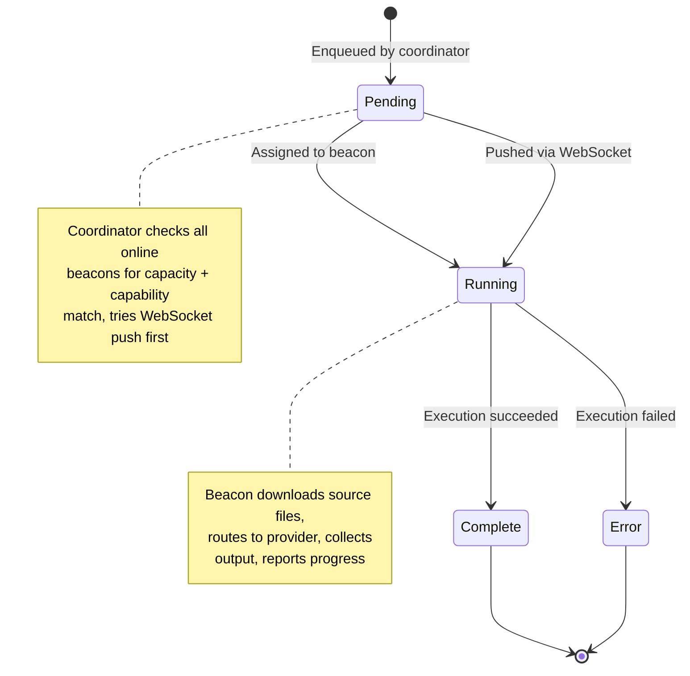

# Architecture

Ultravisor Beacon is designed as a composable system of small, focused classes. The Fable service wrapper (`BeaconService`) provides a high-level API for host applications, while the thin client (`BeaconClient`) handles transport, polling, and execution independently.

## Class Hierarchy

<!-- bespoke diagram: edit diagrams/class-hierarchy.mmd or .hints.json, then: npx pict-renderer-graph build modules/fable/ultravisor-beacon/docs -->

### Component Responsibilities

| Component | Responsibility |
|-----------|----------------|
| **BeaconService** | Fable service lifecycle, capability registration, thin client creation |
| **CapabilityManager** | Stores capability descriptors from the host application |
| **CapabilityAdapter** | Bridges host-app descriptors to the CapabilityProvider interface |
| **BeaconClient** | Authentication, transport negotiation, polling/WebSocket, heartbeat |
| **Executor** | Routes work items to providers, handles file transfer |
| **ProviderRegistry** | Indexes providers by `Capability:Action`, resolves work items to handlers |
| **CapabilityProvider** | Base class for all providers (built-in and custom) |

## Transport Flow

The beacon automatically negotiates the best transport. No configuration is needed -- the decision happens at runtime.

<!-- bespoke diagram: edit diagrams/transport-flow.mmd or .hints.json, then: npx pict-renderer-graph build modules/fable/ultravisor-beacon/docs -->

### Reconnection Behavior

When a WebSocket connection drops:

1. Re-authenticate (get a new session cookie)
2. Attempt WebSocket reconnection
3. If WebSocket fails, fall back to HTTP polling
4. If HTTP also fails, retry after `ReconnectIntervalMs`

The coordinator does not track transport type per beacon. When dispatching a work item, it simply checks if a live WebSocket exists for the target beacon. If not, the work item stays in the queue for polling.

## Work Item Lifecycle

### Execution Pipeline

When the Executor receives a work item:

1. **Resolve** -- `ProviderRegistry.resolve(Capability, Action)` finds the provider
2. **Download** -- If `SourceURL` is set, download the source file (with affinity caching)
3. **Substitute** -- Replace `{SourcePath}` and `{OutputPath}` in the command string
4. **Execute** -- Call `provider.execute(action, workItem, context, callback, progress)`
5. **Collect** -- If `OutputFilename` + `ReturnOutputAsBase64`, encode and attach output
6. **Report** -- Send completion/error/progress to the server (via WebSocket or HTTP)

### File Transfer and Affinity

Work items can include file transfer directives:

- **`SourceURL`** -- URL to download before execution
- **`SourceFilename`** -- Local name for the downloaded file
- **`OutputFilename`** -- Expected output file to collect after execution
- **`ReturnOutputAsBase64`** -- Encode the output file into the result
- **`AffinityKey`** -- Cache downloaded files across work items with the same key

Affinity directories (`affinity-{key}`) persist across work items, avoiding redundant downloads when the same source file is processed multiple times. Work directories (`work-{hash}`) are cleaned up after each work item completes. All affinity directories are cleaned at beacon shutdown.

## Provider Loading

The `ProviderRegistry` supports three provider source types:

| Source Format | Resolution |
|---------------|------------|
| `'Shell'`, `'FileSystem'`, `'LLM'` | Built-in: loaded from `./providers/` |
| `'./my-provider.cjs'` or `/absolute/path` | Local file: `require(resolved path)` |
| `'ultravisor-provider-ml'` | npm package: `require(name)` |

Provider exports can be:

- **Class** -- with `execute()` on the prototype -> instantiated with config
- **Factory function** -- called with config -> returns provider instance
- **Pre-instantiated object** -- with `execute()` method -> registered directly
